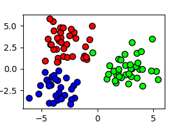
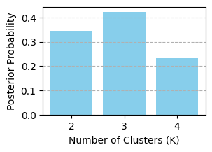
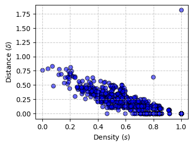

# `cbi_partitions`: Conformalized Bayesian Inference for Random Partition Models

`cbi_partitions` is a Python library for performing Conformalized Bayesian Inference (CBI, introduced by [1]) for clustering problems based on partition-valued MCMC output. Leveraging MCMC samples and the Variation-of-Information (VI) metric between data partitions, the library provides: (i) a principled point estimate of the data clustering; (ii) credible sets of partitions with guaranteed posterior coverage and controlled size, built from conformal prediction principles [3] with a normalized measure of posterior typicality for any given partition (interpretable as a $p$-value and suitable for formal hypothesis testing); and (iii) a density-based clustering approach to explore and summarize the multimodal structure of the posterior distribution over the space of partitions.


## Installation

You can install this library directly from GitHub into any Python environment:

```bash
pip install https://github.com/nbariletto/cbi_partitions/archive/main.zip
```


---

<br>

## Tutorial: Analyzing a multimodal posterior distribution over partitions

This tutorial provides a step-by-step reproduction of the experiment described in [1], consisting of a CBI analysis of MCMC samples from a mixture-based random partition model fit to 2d simulated data. In particular, we will simulate a dataset with ambiguous clustering structure, sample partitions from a Pitman-Yor (PY) Gaussian mixture posterior, and use `cbi_partitions` to quantify uncertainty and detect posterior multimodality.


### 1. Data Simulation and MCMC
We generate a dataset of $N=100$ points from a mixture of 3 Gaussian components. The component-specific means and covariances are set to create overlap between the two leftmost-clusters, which will induce posterior uncertainty. The plot below, showing the original data-generating clustering structure, illustrates this point.

```python
import numpy as np
import matplotlib.pyplot as plt

# --- Simulation Configuration ---
config = {
    'n_obs': 100, 
    'dim': 2, 
    'n_clusters': 3,
    'seed': 12345
}

def simulate_gmm_data(n_obs, dim, n_clusters, seed):
    np.random.seed(seed)
    means = np.array([[-3, -3], [-3, 3], [3, 0]])
    cov = np.eye(dim) * 1.5
    
    true_labels = np.random.randint(0, n_clusters, n_obs)
    X = np.zeros((n_obs, dim))
    
    for i in range(n_obs):
        X[i, :] = np.random.multivariate_normal(means[true_labels[i]], cov)
        
    return X, true_labels

X, true_labels = simulate_gmm_data(**config)

# Visualize Ground Truth
plt.figure(figsize=(3, 2))
plt.scatter(X[:,0], X[:,1], c=true_labels, cmap='brg', edgecolor='k', s=50)
plt.show()
```
<p align="center">
  
</p>

We now fit a $PY(0.03, 0.01)$ mean-covariance Gaussian mixture model. Note that the MCMC implementation we use is based on the `pyrichlet` library [4], which we import here and is easily installed using `pip`. This is just for illustration purposes: in general you can replace your partition-valued MCMC output and directly skip to the next CBI-specific steps.

```python
from pyrichlet import mixture_models 

# MCMC parameters
mcmc_config = {
    'n_final_samples': 6000,
    'burn_in': 1000,
    'thinning': 5,
    'alpha': 0.03,
    'py_sigma': 0.01,
}

print("--- Running Pyrichlet MCMC ---")
total_iter = mcmc_config['burn_in'] + (mcmc_config['n_final_samples'] * mcmc_config['thinning'])
dim = config['dim']

# Initialize sampler
mm = mixture_models.PitmanYorMixture(
    alpha=mcmc_config['alpha'], 
    pyd=mcmc_config['py_sigma'],
    mu_prior=X.mean(axis=0), 
    lambda_prior=0.01,
    psi_prior=np.eye(dim) * 1.5, 
    nu_prior=dim + 2,
    rng=config['seed'], 
    total_iter=total_iter,
    burn_in=mcmc_config['burn_in'], 
    subsample_steps=mcmc_config['thinning']
)

# Run sampler
mm.fit_gibbs(y=X, show_progress=True)

# Extract partitions
mcmc_partitions = [samp['d'] for samp in mm.sim_params]
partitions = np.array(mcmc_partitions, dtype=np.int64)
```

Below we plot the posterior distribution of the number of clusters implied by our model. This gives a preview of the clustering uncertainty implied by the Bayesian model, as partitions with 2, 3, and 4 clusters all receive substantial posterior mass.

```python
from collections import Counter

num_clusters = [len(np.unique(p)) for p in mcmc_partitions]
k_counts = Counter(num_clusters)
k_values_all = sorted(k_counts.keys())
k_probs_all = [k_counts[k] / len(mcmc_partitions) for k in k_values_all]

plt.figure(figsize=(6, 4))
plt.bar(k_values_all, k_probs_all, color='skyblue')
plt.xlabel("Number of Clusters (K)")
plt.ylabel("Posterior Probability")
plt.xticks(k_values_all)
plt.grid(axis='y', linestyle='--')
plt.show()
```

<p align="center">
  
</p>

<br>

### 2. CBI - Initialization

To begin, we import `PartitionKDE` and `PartitionBall` from the `cbi_partitions` library.

```python
from cbi_partitions import PartitionKDE, PartitionBall
```

From [1], recall that the building block of CBI is the computation, for all calibration partition samples $\theta$, of the VI-KDE score

$$s(\theta) = \frac{1}{T}\sum_{t=1}^T e^{-\gamma\cdot \mathcal D_{VI}(\theta,\theta_t)},$$

where $\theta_t, t=1,\ldots,T$ are training partition samples, $\gamma>0$ is a tuning parameter, and $\mathcal D_{VI}$ is the VI distance between partitions. `PartitionBall`, instead, will allow us to compute an alternative score

$$\tilde s(\theta) = - D(\theta, \hat \theta),$$

were $\hat \theta$ is a point estimate of the data clustering. As [1] show, this choice of score yields a conformal set coinciding with a VI-ball centered at $\hat \theta$, whose size we will compare to the VI-KDE score set.

Therefore, we now split the MCMC samples into a *training set* (5000 partitions) to estimate the score and a *calibration set* (1000 partitions) on which to evaluate $s(\theta)$.

```python
np.random.seed(42)
indices = np.arange(partitions.shape[0])
np.random.shuffle(indices)

split_idx = int(len(partitions) * 5/6)
train_partitions = partitions[indices[:split_idx]]
calib_partitions = partitions[indices[split_idx:]]
```

We are now ready to initialize the model and compute the calibration scores. This is done in a few simple lines of code as follows:

```python
# --- Initialize CBI pipeline ---
kde = PartitionKDE(
    train_partitions=train_partitions,
    metric='vi', # default, can select 'binder' as well
    gamma=0.5, # default
    subsample_size=None, # default
    remap_labels=True # default
)

# --- Compute all quantities needed for CBI ---
print("Calibrating KDE model...")
kde.calibrate(calib_partitions)
```

Note: when defining `kde`, the only necessary argument is `train_partitions`. We set everything else at the default values. In particular, the `PartitionKDE` class allows to choose between the VI and Binder losses to perform CBI, the value of $\gamma$, which random training subsample size to use to compute the calibration scores (`None`, which is recommended, uses the whole training set), and whether to perform a custom remapping of the cluster labels that facilitates VI distance computations. Moreover, should the user need them for custom use like plotting, `kde.calib_scores_` and `kde.dpc_delta_` allow to access the computed calibration scores and the separation values $\delta$ needed for the multimodality analysis below.


<br>

### 3. CBI - Pseudo-MAP point estimate

Given the calibration scores we just computed, we compute the point estimate as the calibration partition with highest VI-KDE score. This is done using the `.get_point_estimate()` method.

```python
point_est_partition = kde.get_point_estimate()

plt.figure(figsize=(6, 4))
plt.scatter(X[:,0], X[:,1], c=point_est_partition, cmap='brg', edgecolor='k', s=50)
plt.show()
```

<p align="center">
  
</p>

Given the uncertain clustering, the point estimate is picked as a 2-cluster partition, which essentially collapses the two left-most, ambiguously separated clusters.


<br>

### 4. CBI - Multimodality analysis
Following [1], we analyze posterior multimodality using ideas from density-based clustering [5], using the VI-KDE as a proxy for posterior density. In particular, our calibration step above already computed (a) the calibration VI-KDE score $s(\theta)$ as well as the parameter $\delta(\theta$ for every calibration sample $\theta$. Recall from [1] that $\delta(\theta)$ measures the distance between $\theta$ and the closes calibration partition with a higher KDE score. Hence, it is enough to look at the decision graph below and to pick as posterior modes those partitions displaying abnormally large values of both $s(\theta)$ (meaning they lie in high-density regions) and $\delta(\theta)$ (meaning that they are well separated from other high-density samples).

```python
kde.plot_dpc_decision_graph()
plt.show()
```

<p align="center">
  
</p>

There are clearly two modes, corresponding to the two points that stand out in the the north-east corner of the decision graph. Below we retrieve the corresponding partitions using visually picked $s$ and $\delta$ thresholds and visualize them.

```python
modes_idx = kde.get_dpc_modes(s_thresh=0.75, delta_thresh=0.6)

fig, axs = plt.subplots(1, 2, figsize=(12, 4))
for i in range(2):
    axs[i].scatter(X[:,0], X[:,1], c=calib_partitions[modes_idx[i]], cmap='brg', edgecolor='k', s=50)
plt.show()
```

<p align="center">
  
</p>

This reveals that both the KDE point estimate (by construction of the density-based clustering procedure) and a partition with three clusters, very similar to the data-generating one, find support as modes of the posterior distribution.

<br>

### 5. CBI - Hypothesis Testing
Point estimation and multimodality give a picture of the posterior. We now proceed to test wether a specific, user-specified partition $\theta$ is supported as typical under the posterior. Following [1], this is done by computing the conformal $p$-value

$$p(\theta) = \frac{1 + \text{no. of calibration samples with } s(\cdot)\leq s(\theta)}{1 + \text{no. of calibration samples}}$$,

which can be formally interpreted as a $p$-value under the null hypothesis that the calibration samples and $\theta$ are jointly iid under the posterior, or simply as a measure of posterior typicality. Importantly, the set of $theta$'s with $p(\theta) \geq \alpha$ is guaranteed to have posterior coverage more than $1-\alpha$ (see [1] for more details).

Hence, we test four specific clustering hypotheses to see if they are consistent with the posterior, picking the test level at $\alpha=0.1$ (so the resulting set will have guaranteed posterior coverage of 90%).

1.  **The true partition;**
2.  **The ''collapsed'' partition:** Merging the two leftmost ground-truth clusters;
3.  **The one-cluster trivial partition:** This tests whether full homogeneity among data points is supported by the posterior;
4.  **The 100-cluster trivial partition:** This tests whether full heterogeneity among data points is supported by the posterior.


```python
# Collapsed partition (merge true left-most clusters)
collapsed_labels = true_labels.copy()
collapsed_labels[collapsed_labels == 1] = 0

# One-cluster partition (full homogeneity hypothesis)
one_cluster_partition = np.ones(config['n_obs'])

# 100 cluster partition (full heterogeneity hypothesis)
n_cluster_partition = np.arange(config['n_obs'])

# Compute and display p-values
p_val_true = kde.compute_p_value(true_labels)
p_val_coll = kde.compute_p_value(collapsed_labels)
p_val_one = kde.compute_p_value(one_cluster_partition)
p_val_n = kde.compute_p_value(n_cluster_partition)

print(f"Ground Truth (K=3) p-value:    {p_val_true:.4f}")
print(f"Collapsed (K=2) p-value:       {p_val_coll:.4f}")
print(f"One cluster p-value:           {p_val_one:.4f}")
print(f"100 cluster p-value:           {p_val_n:.4f}")
```

```text
Ground Truth (K=3) p-value:    0.3756
Collapsed (K=2) p-value:       0.6893
One cluster p-value:           0.0010
100 cluster p-value:           0.0010
```

As expected from our multimodality analysis, both the true partition and its collapsed version are included in the set as highly tipical parameter values under the posterior (indeed, we identified them as modes). Instead, both full homogeneity and full heterogeneity are strongly ruled out.

<br>

### 6. Comparison with VI balls
Finally, we compare results between the VI-KDE score procedure and the VI ball centered around our point estimate (recall that it essentially coincides with the ``collapsed'' true partition). The VI ball with posterior coverage $1-\alpha$, initially proposed by [6], is obtained within the CBI framework using the negative VI distance $\tilde s(\theta)$ from the point estimate as a score, which we implemented using the `PartitionBall` class.

In particular, we are interested in comparing the size of the two sets. Because we have found two modes, we suspect that the posterior may place most of its mass close to each mode, but not much mass either ``between'' the two modes or far from both. Intuitively, think of a bimodal distribution on the real line, with two quite well separated modes. Therefore we test inclusion in both sets of

1.  **A partition far from both modes**, moving away from the ''collapsed'' partition in the opposite direction compared to the true partition.
2.  **A partition ''between'' the two modes.**

Here is a plot of what these two partitions look like:

```python
# 2. Partition far from modes (vertical split)
far_labels = (X[:, 0] > 2.5).astype(np.int64)

# 3. Partition between modes (collapsed partition with split top-left corner)
between_labels = collapsed_labels.copy()
mask = (between_labels == 0) & (X[:, 1] >= 3.23)
between_labels[mask] = 5

fig, axs = plt.subplots(1, 2, figsize=(8, 3))
for i in range(2):
    axs[i].scatter(X[:,0], X[:,1], c=[far_labels, between_labels][i], cmap='brg', edgecolor='k', s=50)
    axs[i].set_title(["Far from modes","Between modes"][i])
plt.show()
```

<p align="center">
  
</p>

We now check what hypothesis testing produces under the VI-KDE and VI-ball scores.

```python
# Run conformal tests with KDE score
p_val_far = kde.compute_p_value(far_labels)
p_val_between = kde.compute_p_value(between_labels)

# Initialize VI-ball procedure
ball_model = PartitionBall(
    point_estimate_partition=point_est_partition,
    metric='vi'
)
ball_model.calibrate(calib_partitions)

# Test 'far-from-modes' and 'between-modes' partitions with ball score
p_val_far_ball = ball_model.compute_p_value(far_labels)
p_val_between_ball = ball_model.compute_p_value(between_labels)

# Results
print(f"Far-from-modes partition p-value (KDE):        {p_val_far:.4f}")
print(f"Between-modes partition p-value (KDE):         {p_val_between:.4f}")
print(f"Far-from-modes partition p-value (Ball):       {p_val_far_ball:.4f}")
print(f"Between-modes partition p-value (Ball):        {p_val_between_ball:.4f}")
```

```text
Far-from-modes partition p-value (KDE):        0.0010
Between-modes partition p-value (KDE):         0.0819
Far-from-modes partition p-value (Ball):       0.1399
Between-modes partition p-value (Ball):        0.2587
```

The above results nicely show that, while the VI-KDE score procedure adapts naturally to the multimodality of the posterior, yielding a credible set that ''skips'' over low-density regions in the partition space either between modes or far from them, the VI-ball with the same coverage is insensitive to the shape of the posterior because the radius of the ball is ''enlarged in all directions'' starting from the point estimate until coverage is reached, and ends up including low-density partitions like the ones we tested.

<br>

### References

[1] Bariletto, N., Ho, N., & Rinaldo, A. (2025). Conformalized Bayesian Inference, with Applications to Random Partition Models. arXiv preprint arXiv:2511.05746.

[2] Meilă, M. (2007). Comparing clusterings—an information based distance. Journal of Multivariate Analysis, 98(5), 873-895.

[3] Vovk, V., Gammerman, A., & Shafer, G. (2005). Algorithmic learning in a random world. Boston, MA: Springer US.

[4] Selva, F., Fuentes-García, R., & Gil-Leyva, M. F. (2025). pyrichlet: A Python Package for Density Estimation and Clustering Using Gaussian Mixture Models. Journal of Statistical Software, 112, 1-39.

[5] Rodriguez, A., & Laio, A. (2014). Clustering by fast search and find of density peaks. Science, 344(6191), 1492-1496.

[6] Wade, S., & Ghahramani, Z. (2018). Bayesian cluster analysis: Point estimation and credible balls (with discussion). Bayesian Analysis, 13(2), 559–626.


